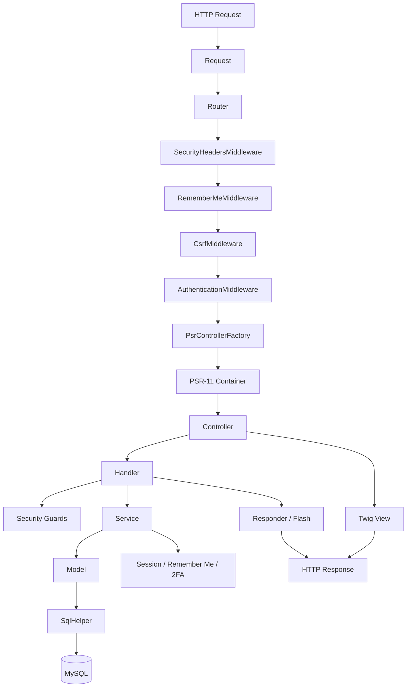

# CodingBlog - Blog PHP POO

This project is a blog application built in pure PHP using object-oriented programming and the MVC architecture pattern, without any external framework.
It is intended for learners, junior developers, or anyone who wants to understand the fundamentals of PHP web development by building a structured and maintainable application from scratch.

## Badges

[](https://app.codacy.com/gh/aerial978/coding-blog/dashboard?utm_source=gh&utm_medium=referral&utm_content=&utm_campaign=Badge_grade)

## Features

- User registration with email account confirmation
- Secure user authentication and logout
- Google OAuth authentication
- Email-based two-factor authentication (2FA)
- Remember-me authentication
- Password recovery and secure password reset
- Account confirmation email resend
- User account area
- Protection against automated and abusive authentication attempts

## Authentication & Security Flow

The authentication system follows a layered security approach :

- Multi-step validation (client + server)
- Token-based password reset flow
- Controlled session lifecycle
- Abuse protection (rate limit, quotas, Turnstile)
- Logging of all sensitive actions (authentication, recovery, email events)
- Secure registration flow with anti-bot and validation layers
- Controlled email confirmation resend mechanism with anti-enumeration
- Usernames are treated case-insensitively for authentication and uniqueness

## Account Recovery

The application includes a complete and secure account recovery flow :

- Forgot password request with anti-enumeration protection
- Secure password reset via time-limited token
- One-time token consumption upon successful password update
- Protection against token reuse and expiration
- Neutral user feedback to prevent account discovery
- Rate-limited password reset requests

## Prerequisites

Before installing the project, make sure the following tools are available:

- **PHP 8.2.13**
- **Composer 2**
- **Node.js**
- **npm**
- **MySQL**

## Installation

1. **Clone the repository**

```bash
git clone https://github.com/aerial978/coding-blog.git
cd coding-blog
```

1. **Install PHP dependencies**

Install the PHP packages defined in `composer.json`:

```bash
composer install
```

1. **Install front-end dependencies**

Install Bootstrap, Sass, and the development tools defined in `package.json`:

```bash
npm install
```

1. **Configure the environment**

Copy `.env.example` to `.env`.

On Linux/macOS:

```bash
cp .env.example .env
```

On Windows PowerShell:

```powershell
Copy-Item .env.example .env
```

Then edit `.env` and configure the values for your local environment,
including:

- application environment and base URL
- MySQL database connection
- mail transport and credentials
- Cloudflare Turnstile keys
- Google OAuth credentials and callback URL

Do not commit `.env`, as it may contain credentials and other secrets.

1. **Configure the database**

Create the MySQL database specified by `DB_NAME` in `.env` and make sure
the configured database user has access to it.

The database schema must be created separately, as the project does not
currently provide an automated migration or schema initialization process.

## Architecture

CodingBlog follows a custom MVC-inspired architecture designed to keep
responsibilities clearly separated and the application easy to maintain.

- **MVC**
  - Controllers receive HTTP requests and delegate the business logic.
  - Models handle database access and entity hydration.
  - Views are rendered with Twig templates.

- **Router**
  - Maps HTTP methods and URIs to controller actions.
  - Normalizes request paths and handles 404 and 500 responses.
  - Executes the configured middleware chain before dispatching controllers.

- **Container**
  - A PSR-11 compatible dependency injection container centralizes service creation.
  - Service providers register controllers, services, models, middleware, loggers,
    and infrastructure dependencies.

- **Middleware**
  - Middleware components execute before controllers.
  - They handle cross-cutting concerns such as authentication, CSRF protection,
    remember-me restoration, and HTTP security headers.

- **Twig**
  - Twig is used as the templating engine.
  - Layouts, partials, components, and form macros are separated from PHP business logic.

- **Services**
  - Business logic is isolated in dedicated service classes.
  - Services handle authentication, registration, password recovery, account confirmation,
    remember-me authentication, email 2FA, and OAuth workflows.

### Request Flow



## Tech Stack

- **Server language**: PHP 8.2 (OOP)
- **Database**: MySQL
- **Templating**: Twig
- **Front-end**: HTML5, CSS3, JavaScript (Vanilla)
- **Quality tools**:
  - PHPUnit (unit tests)
  - PHPStan, PHPCS, PHP CS Fixer, PHPMD (static analysis, quality)
  - ESLint (JavaScript)
  - Stylelint (SCSS)
  - Roave/Security-Advisories (dependency security)
- **Logging**: Monolog (multi-channel file logging)
- **Environment loader**: vlucas/phpdotenv
- **Error management**: custom global ErrorHandler with user-friendly error pages

## Running Tests & Quality

To run tests, run the following command

```bash
  composer test
```

To run the code analysis, run the following command

```bash
  composer lint        # PHPCS
  composer lint:fix    # PHPCBF
  composer cs:check    # PHP-CS-Fixer (dry run)
  composer cs:fix      # PHP-CS-Fixer (auto-fix)
  composer stan        # PHPStan
  composer md          # PHPMD
```

To run the Javascript, SCSS & markdown code analysis, run the following command

```bash
npm run lint:js      # ESLint
npm run lint:js:fix
npm run lint:scss    # Stylelint
npm run lint:md      # Markdownlint
```

## Security

CodingBlog implements a series of robust, defence-in-depth security mechanisms typically found in modern, production-ready applications :

- Csrf Middleware
- Honeypot anti-bot field
- Minimal & maximal submission delay (anti-bot timing control)
- Cloudflare Turnstile (bot detection & abuse prevention)
- Registration throttling (IP + User-Agent)
- Email confirmation resend quotas
- Disposable email blocking
- Password blacklist (common password prevention)
- Secure session tokens used for CSRF protection and form timing validation
- Security headers middleware
- Automatic injection of headers strengthening browser-side security
- Structured logging (per-domain security logs)
- Secure password reset tokens (hashed, time-limited, single-use)
- Anti-enumeration mechanisms on authentication and recovery flows
- Email-based quota limiting for sensitive actions (reset, resend)
- Step-up security (Turnstile escalation on suspicious activity)
- Secure registration flow with layered protections (validation, Turnstile, rate limiting)
- Controlled confirmation email resend with anti-enumeration and quotas

## Future Improvements

Possible future improvements include:

- Add article creation, editing, and deletion features.
- Add a commenting system.
- Add an administration interface.
- Add automated database migrations and schema initialization.
- Improve the front-end design and overall user experience.
- Add end-to-end tests for critical application workflows.
- Provide production deployment documentation.

## License

[MIT](https://choosealicense.com/licenses/mit/)
